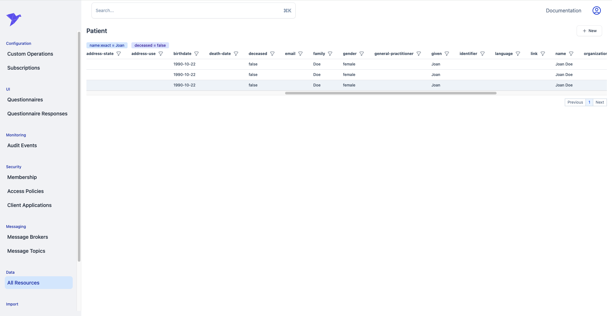

# Updates 2024-05-14

## Admin Application Enhancements

## Search Table Component
We've published a generative search table for FHIR.
This [component](https://storybook.iguhealth.app/?path=/docs/generated-fhirgenerativesearchtable--docs) will automatically query for search parameters for a given resource type and display parameters as columns with the ability to filter and sort on each column.
We've updated the admin app to use this table for searching resources.




## Display Components
We now support readonly react components for the following data types:

* Address [here](https://storybook.iguhealth.app/?path=/docs/complex-fhiraddressreadonly--docs)
* CodeableConcept [here](https://storybook.iguhealth.app/?path=/docs/complex-fhircodeableconceptreadonly--docs)
* Coding [here](https://storybook.iguhealth.app/?path=/docs/complex-fhircodingreadonly--docs)
* HumanName [here](https://storybook.iguhealth.app/?path=/docs/complex-fhirhumannamereadonly--docs)
* Identifier [here](https://storybook.iguhealth.app/?path=/docs/complex-fhiridentifierreadonly--docs)
* Period [here](https://storybook.iguhealth.app/?path=/docs/complex-fhirperiodreadonly--docs)
* Quantity [here](https://storybook.iguhealth.app/?path=/docs/complex-fhirquantityreadonly--docs)
* Range [here](https://storybook.iguhealth.app/?path=/docs/complex-fhirrangereadonly--docs)


## IGUHealth Provider
We've updated IGUHealth Provider to support the following features:
* The client will now automatically initiate authentication flow after token expiration.
* Support for client-side redirects after successful login. This allows SPAs to redirect users back to their starting location in the app after a successful login.

## Support for Missing
All parameters now support the missing modifier. This allows you to search for resources that do not have a value for a given parameter.
```bash
GET /Patient?name:missing=true
```

