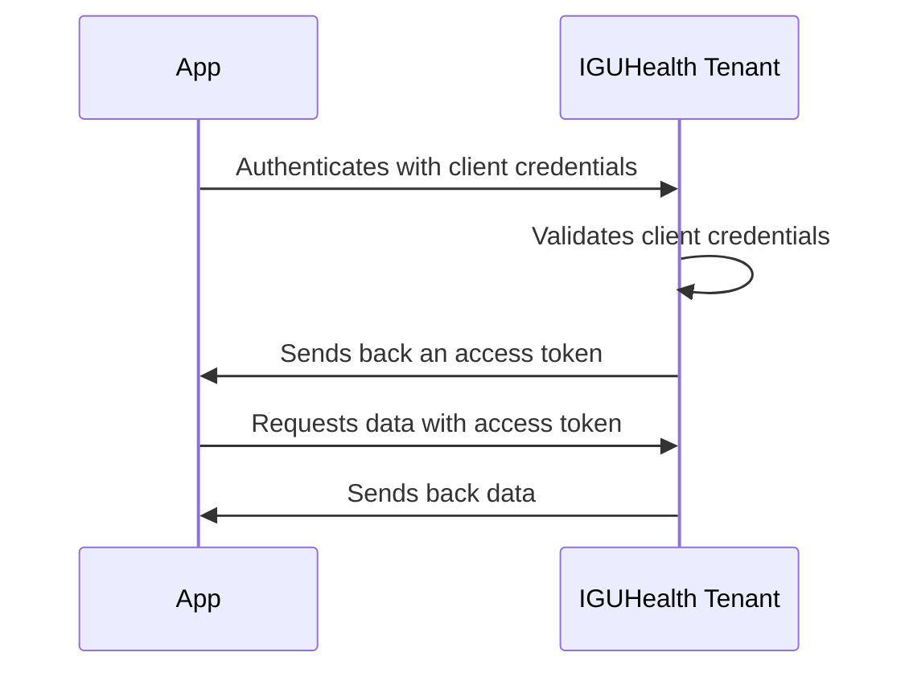
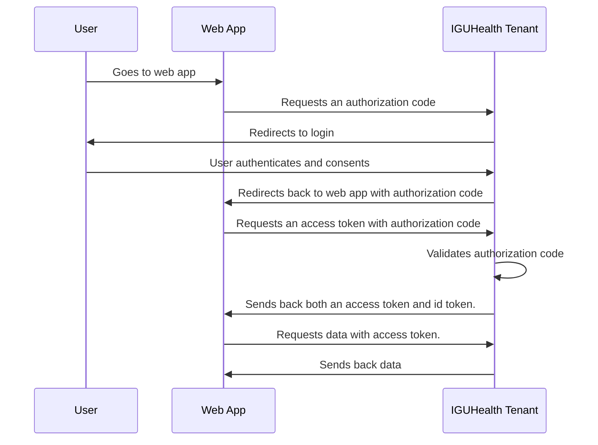

import TabItem from "@theme/TabItem";
import Tabs from "@theme/Tabs";

# Overview

This section covers the basics of authentication in IGUHealth.
Each IGUHealth tenant is its own IDP(OIDC provider), and you can use the OIDC protocol to authenticate users and clients.

## Registration 
Client registration is done through the [ClientApplication](../Data_Model/R4/ClientApplication.mdx) resource.
To register a client you create a new Client Application via the API or the Admin UI.

### Creating a Client Application
<Tabs>
  <TabItem value="cli" label="IGUHealth CLI">
  ```bash
  iguhealth create r4 ClientApplication --file clientapplication.json
  ```
  </TabItem>
  <TabItem value="admin" label="Admin UI">
    1. Go to the Admin UI
    2. Click on sidebar Security -> Client Applications
    3. Click `New` on the top right 
    4. Fill in the form to create a new Client Application.
  </TabItem>
  <TabItem value="curl" label="Bash">
  ```bash
   curl --request POST --header "Authorization: Bearer <token>" --header "Content-Type: application/fhir+json" --file clientapplication.json https://api.iguhealth.app/w/{tenant}/api/v1/fhir/r4/ClientApplication
  ```
  </TabItem>
</Tabs>

## Authentication flows
Below is a diagram of the two main authentication flows supported by IGUHealth.
To authenticate a machine/trusted client you should use the client credentials flow.
To authenticate a user you should use the authorization code flow.

### Client Credentials


### Authorization Code



## React provider
To make it easier to authenticate users in a React application, we provide a component that will automate the authorization code flow.
You can read more about this component [here](./OIDC.mdx#frontend-react).