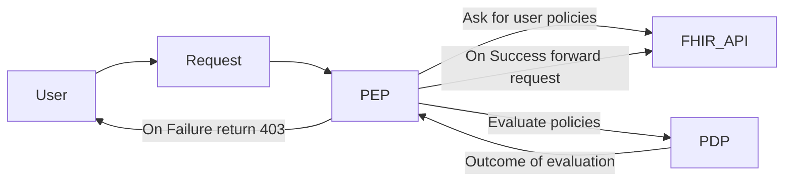

---
tags:
  - proposal
  - RFC
---

# [RFC] AccessPolicy V2

## Abstract

Current AccessPolicy is built around the FHIR API (or to allow full access). 
As an example we disallow access based on the type of request and/or the type of resource being accessed.

The goal of this RFC is to introduce a new AccessPolicy that is more flexible and allows for more granular control over access to resources.
Although this Access Policy is built on top of the FHIR standard it's evaluation is not dependent on knowleadge of the FHIR API.
Instead it is modeled around the concepts of **rules** which are evaluated to true/false and combinatorial like logic of those rules.

## Background

Current [AccessPolicy](../documentation/Data_Model/R4/AccessPolicy.mdx) leverages simple logic to assert the type of request coming in 
and then allows or denies access based on the type of request (read-request, search-request etc...) and the resourcetype. 
This logic is what determines what operations and resources a user can access.  If a user is denied access to a resource,
the system will return a 403 Forbidden response with an OperationOutcome detailing the reason for the denial.

## Problem
This system does not take into account contextual information about the user. 
It does not allow filtering in a more granular way such as allowing a Practitioner to only access their own patients.

It also is not possible to model [patient](https://hl7.org/fhir/smart-app-launch/scopes-and-launch-context.html#patient-specific-scopes) scopes from SMART on FHIR using the current [AccessPolicy](../documentation/Data_Model/R4/AccessPolicy.mdx).


## Proposal

To create a new FHIR resource called AccessPolicyV2 built around the concept of rules.  
Each rule will be evaluated to true or false and the AccessPolicyV2 will be evaluated to true or false based on the rules.

### Context

The Context will have the following properties:
* User 
  * Claims: This will be the list of claims a user has pulled from the access token.
  * Membership: The Membership resource that's associated to the user.
* Request
  * FHIR Request: The FHIR request that's being made.
  * Http Request: The HTTP request that's being made This will include the method, path, headers, query.


### Rules
A Rule is composed of a conditional logic evaluating to true or false. Each assertion will allow either hardcoded values or [fhirpath expressions](https://hl7.org/fhir/R4/metadatatypes.html#Expression).
FHIRPath expressions will be evaluated with variables for context \(see above\).

**Simple Assertion**
```json
{ 
    "condition": {
        "operator": "equals",
        "left": { valueExpression: {"expression": "%request.http.method", "language": "text/fhirpath" }, 
        "right": { valueString: "GET" },
    }
}
```
**Nested**
```json
{
    "rule": [
        { 
            "combineBehavior": "all",
            "condition": {
                "operator": "equals",
                "left": { valueExpression: {"expression": "%request.http.method", "language": "text/fhirpath" }, 
                "right": { valueString: "GET" },
            }
        }
    ]
}
```


### Evaluation
A few notes on relationships
- User 0..* Access policies
- AccessPolicy 0..* Rules
- Rule 0..* Rules Nested children rules where the parent rule is evaluated to true if all children rules are evaluated to true
 with and logic and false if any child rule is evaluated to false. 

#### Rule evaluation
Rule evaluation is based around the condition property which defines the operator and expressions for a boolean evaluation.
For more complicated rules we can combine rules with the combineBehavior property.
The combineBehavior being set to **all** means all sub rules must evaluate to true for the parent rule to evaluate to true.
The combineBehavior being set to **any** means any sub rule that evaluates to true will cause the parent rule to evaluate to true.

#### AccessPolicyV2 Evaluation
The AccessPolicyv2 will evaluate as whether passed or failed (with details provided in the OperationOutcome) based on the rules.
The AccessPolicyV2 at the top level uses or logic to evaluate the rules in it's AccessPolicyV2.rule property.

#### User with multiple AccessPolicyV2 resources 
If a user has multiple AccessPolicyV2 the system will loop through each policy and evaluate until one is successful. 
If none are successful the system will return a 403 Forbidden response with an OperationOutcome detailing the reason for the denial.

### System Flow



## Down the Road
### Domain Specific Language
We will consider writing a DSL that will serialize to the AccessPolicyV2 Resource.

### Pulling external data
Possible to consider pulling in external data to evaluate rules. This could mean pulling in an List resource to evaluate if a user is a member of that List etc...
