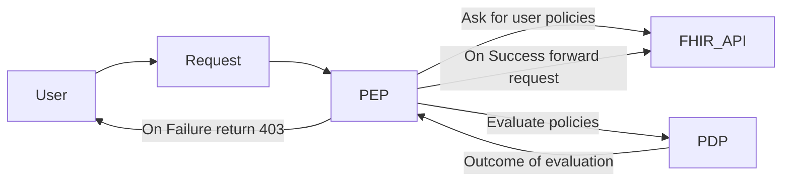

---
tags:
  - proposal
  - RFC
---

# [RFC] AccessPolicy V2

## Abstract

Current AccessPolicy is built around the FHIR API (or to allow full access). 
As an example we disallow access based on the type of request and/or the type of resource being accessed.

The goal of this RFC is to introduce a new AccessPolicy that is more flexible and allows for more granular control over access to resources.
Although this Access Policy is built on top of the FHIR standard it's evaluation is not dependent on knowleadge of the FHIR API.
Instead it is modeled around the concepts of **rules** which are evaluated to true/false and combinatorial like logic of those rules.

## Background

Current [AccessPolicy](../documentation/Data_Model/R4/AccessPolicy.mdx) leverages simple logic to assert the type of request coming in 
and then allows or denies access based on the type of request (read-request, search-request etc...) and the resourcetype. 
This logic is what determines what operations and resources a user can access.  If a user is denied access to a resource,
the system will return a 403 Forbidden response with an OperationOutcome detailing the reason for the denial.

## Problem
This system does not take into account contextual information about the user. 
It does not allow filtering in a more granular way such as allowing a Practitioner to only access their own patients.

It also is not possible to model [patient](https://hl7.org/fhir/smart-app-launch/scopes-and-launch-context.html#patient-specific-scopes) scopes from SMART on FHIR using the current [AccessPolicy](../documentation/Data_Model/R4/AccessPolicy.mdx).

## Proposal

To create a new FHIR resource called AccessPolicyV2 built around the concept of rules.  
Each rule will be evaluated to true or false and the AccessPolicyV2 will be evaluated to true or false based on the rules.

### Flow

## Down the Road
### Domain Specific Language
We will consider writing a DSL that will serialize to the AccessPolicyV2 Resource.

## Alternative Solutions `<Optional>`
Describe any alternative solutions that were considered and why they were not chosen.

## Migration Plan `<Optional>`
Describe how the changes will be rolled out and what impact they will have on existing systems.