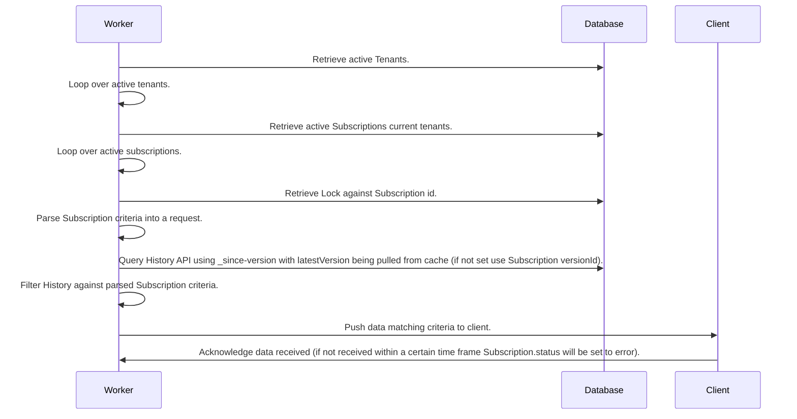

---
tags:
  - proposal
  - RFC
---

# [RFC] R4B Subscription Framework

## Abstract
Currently we use R4 Subscriptions see [here](../documentation/Data_Model/R4/Subscription). 
The goal of this RFC is to migrate to R4B Subscription framework, depricating R4 Subscriptions and to allow a higher throughput for Subscriptions.

## Background

R4B introduces a new SubscriptionTopic resource that defines the criteria for a Subscription (this was previously defined on the Subscription resource itself). 
This decouples the criteria from the client (Subscription in this case).

### Current Architecture

## Problem

### Issues with current implementation

* Acknowledgement of data is waited on loop which will lead to low throughput and potential block.
* Uses Redlock may not be sound see [here](https://martin.kleppmann.com/2016/02/08/how-to-do-distributed-locking.html).
* Because Subscription is coupled with client, duplicate work is likely to occur.

## Proposal

## Migration Plan
* Setup db-migrate to query for active Subscription resources and migrate criteria into a SubscriptionTopic resource.
* Going forward R4 Subscriptions will be deprecated and all new Subscriptions will be created using SubscriptionTopic.