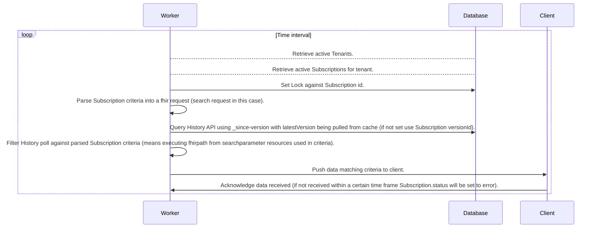
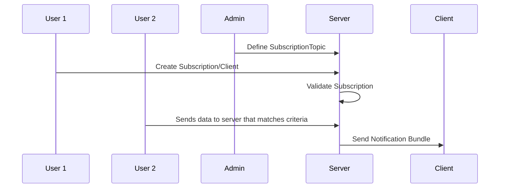
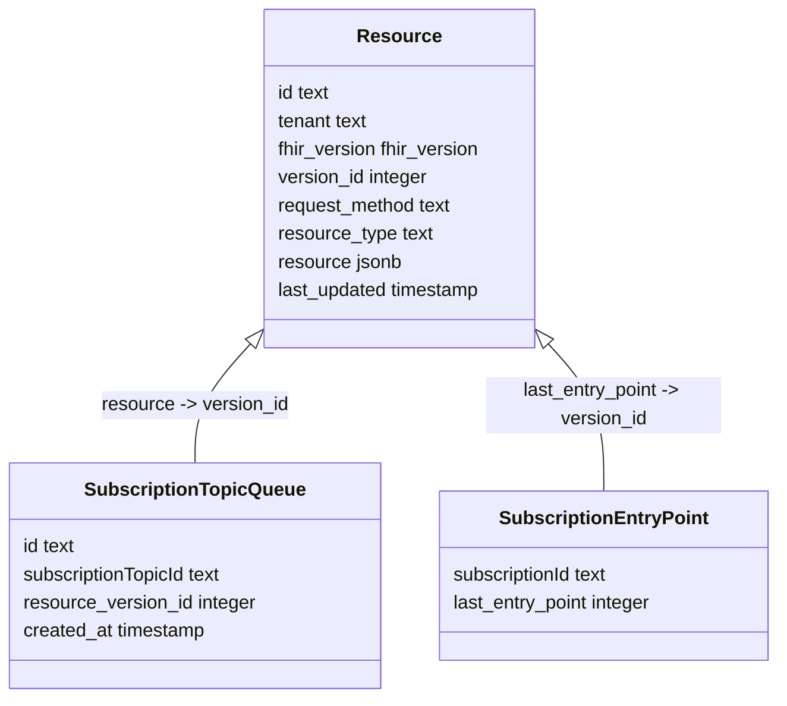
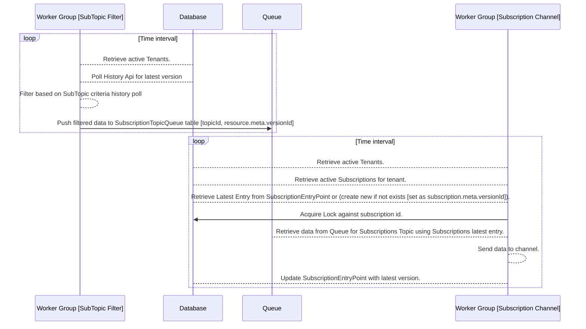

---
tags:
  - proposal
  - RFC
---

# [RFC] R4B Subscription Framework

## Abstract
Currently we use R4 Subscriptions see [here](../documentation/Data_Model/R4/Subscription). 
The goal of this RFC is to migrate to R4B Subscription framework, depricating and/or migrating R4 Subscriptions and to allow a higher throughput for Subscriptions.

## Background

R4B introduces a new SubscriptionTopic resource that defines the criteria for a Subscription (this was previously defined on the Subscription resource itself). 
This decouples the criteria from the client (Subscription in this case).

### Current Architecture
A few notes on the current architecture:
1. Resources are stored as a log within postgres this means querying for history API is relatively lowcost.
2. Because search_indices will be modified on updates we do filtering in memory not via SQL.

#### Diagram

* Definitions:
  * Worker: Node process
  * Database: Postgres and/or Redis
  * Client: Endpoint defined by subscription where data gets sent too.

## Problem

### Issues with current implementation

* Acknowledgement of data is waited on loop which will lead to low throughput and potential block.
* Uses Redlock may not be sound see [here](https://martin.kleppmann.com/2016/02/08/how-to-do-distributed-locking.html).
* Because Subscription is coupled with client, duplicate work is likely to occur.
* Storage of latest version not in DB but instead on cache (Redis).
* Is not compatible with notification framework (should use history bundle).

## Proposal
Migration to [Topic based Subscriptions](https://build.fhir.org/ig/HL7/fhir-subscription-backport-ig/components.html) and implement system where throughput is not dictated by the client.

### Data Model
* [Subscription](https://build.fhir.org/ig/HL7/fhir-subscription-backport-ig/StructureDefinition-backport-subscription.html)
  defines a client that receives events from a subscription topic.
* [SubscriptionTopic](https://hl7.org/fhir/R4B/subscriptiontopic.html)
   defines the criteria that causes a subscription to trigger. Also defines additional filters a subscription (or client) can define.
* [Notifications Model](https://build.fhir.org/ig/HL7/fhir-subscription-backport-ig/components.html#subscription-notifications)
  is the structure of what gets sent to the client.
  * First entry SubscriptionStatus or Parameters resource in R4
  * Type use R4/R4B `history` or for R5 `subscription-notification`
  * 

### End User Flow

1. Admin defines SubscriptionTopics that define criteria clients/subscriptions can subscribe too.
2. Client/User subscribes to a SubscriptionTopic by creating a Subscription Resource
   * When processing a request for a Subscription, following are some checks that a server SHOULD validate:
      * that the SubscriptionTopic is valid and implemented by the server
      * that all requested filters are defined in the requested topic and are implemented in the server
      * that the channel type is known and implemented by the server
      * that the channel endpoint is valid for the channel provided (e.g., is it a valid URL of the expected type)
      * that the payload configuration is known and implemented by the server
      * that the payload configuration is valid for the channel type requested (e.g., complies with the server’s security policy)
4. Some user sends data to server.
5. Server pushes data to client that matches criteria.

#### Diagram

### Architecture

#### Data Model

1. Resource Table
   * Stores all resources that are created/updated/deleted.
2. SubscriptionTopicQueue
    * Stores all resources that match a SubscriptionTopic criteria.
3. SubscriptionEntryPoint
    * Stores the last versionId that was sent to a Subscription.
    * Used as a distributed lock to prevent multiple workers from sending the same data to a Subscription.

#### Scaling

## Migration Plan

### [Option 1] Use backport option for R4 Subscription Topics (use Basic as underlying model)
See https://build.fhir.org/ig/HL7/fhir-subscription-backport-ig/components.html#subscription-topics-in-r4 for more information.

### [Option 2] Mig and Depreicate R4 Subscription Support
* Setup db-migrate to query for active Subscription resources and migrate criteria into a SubscriptionTopic resource.
* Going forward R4 Subscriptions will be deprecated and all new Subscriptions will be created using SubscriptionTopic.
